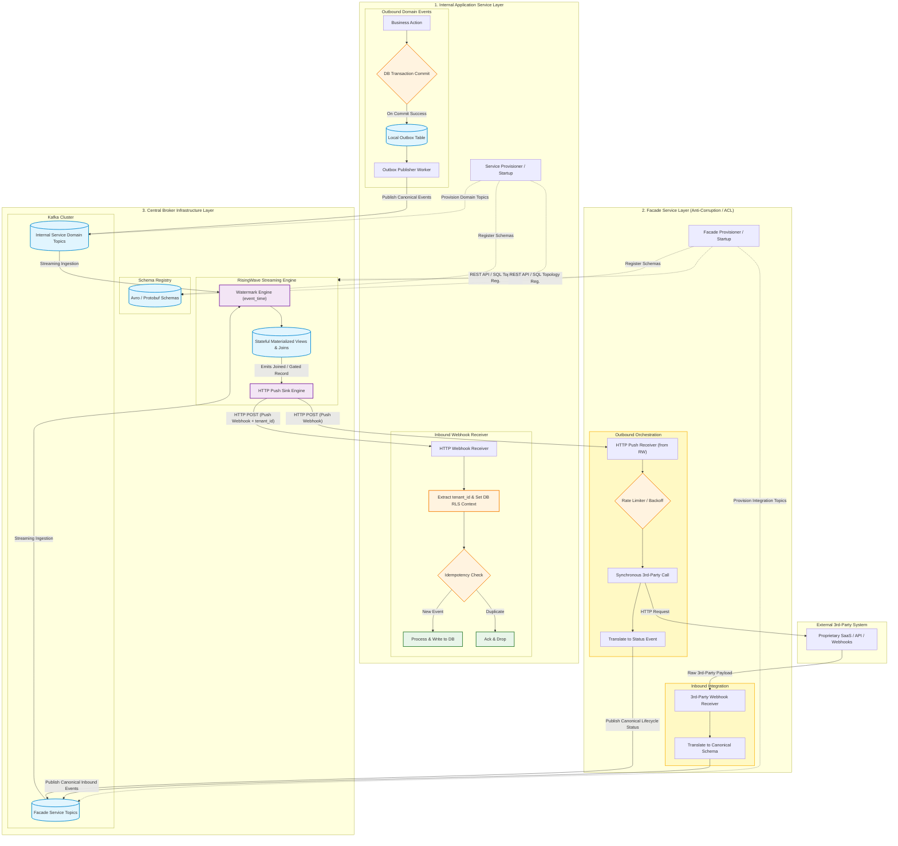

# Rules

### 1. Our Main Goal (And why it works)

Our primary goal with the Asymmetric Integration System is exactly one thing: **Keep our internal application codebases entirely symmetric, asynchronous, and eventually consistent while interfacing with third-party "Black Box" systems and internal serverless/containerized domains.**

We do not leak proprietary SaaS logic into our core domain, hold open synchronous HTTP threads waiting for state, or allow unbuffered event storms to crush workers. We achieve this by combining a **Physical Anti-Corruption Facade**, a **Transactional Outbox Pattern**, a **Broker Infrastructure (Kafka + Schema Registry + RisingWave)**, and **Service-Driven Self-Registration**.

#### Why does this approach work?

Application Services and Facades act as autonomous, bounded entities—handling both event generation via transactional outboxes and event consumption via incoming HTTP webhooks. Instead of forcing these services to run complex polling or in-memory gating loops:

1. **Topic & Schema Ownership:** During deploy/startup, each service provisions its own dedicated Kafka topics and registers its schemas directly to the **Schema Registry**.
2. **Stream Topology Self-Registration:** Services programmatically register their streaming topologies (`CREATE SOURCE`, `WATERMARK`, `CREATE MATERIALIZED VIEW`, and `CREATE SINK WITH (connector='http')`) directly onto **RisingWave** via API/SQL calls upon startup.
3. **Push-Based Ingestion:** RisingWave manages out-of-order event watermarking, stateful gating, and multi-tenant isolation, delivering clean, ready-to-process canonical facts via **HTTP Push Sinks** to downstream endpoints.

---

### 2. The Architectural Blueprint



---

### 3. The Core Directives (How to execute)

#### Directive 1: Unified Application Boundary

- **What it is:** Producer and consumer functions are combined into a single **Internal Application Service** boundary.
- **How to do it:** A microservice owns its domain data model end-to-end. It generates domain facts by writing to its local transactional outbox table, and it consumes canonical facts through inbound HTTP webhook endpoints exposed by its HTTP receiver layer.

#### Directive 2: Autonomous Service Topic & Stream Registration

- **What it is:** Application and Facade services fully own their transport structures and stream topologies. Stream configs are not set up manually out-of-band.
- **How to do it:** During CI/CD deployment or process startup:
    1. The service provisions its required **Kafka Topics** on the Kafka Cluster.
    2. The service registers the payload structures into the **Schema Registry**.
    3. The service calls **RisingWave** via its REST API or SQL connection to register its `CREATE SOURCE` (with `WATERMARK FOR event_time`), `CREATE MATERIALIZED VIEW`, and `CREATE SINK ... WITH (connector='http')`.

#### Directive 3: Offload Event Gating and Watermarking to RisingWave

- **What it is:** Application Services must **never** execute `sleep()` loops or polling logic to wait for prerequisite entities (e.g., waiting for a `Customer` before processing an `Order`).
- **How to do it:** Define an `INNER JOIN` Materialized View inside RisingWave matching entities on `(tenant_id, entity_id)`.
    - If the prerequisite entity exists, RisingWave emits the joined event instantaneously (**0ms delay**).
    - If the prerequisite entity is delayed, RisingWave holds the dependent event in its state store until the watermark closes or the prerequisite arrives, emitting the event only when the gate resolves.

#### Directive 4: Strict Multi-Tenant Header Propagation (`tenant_id` and RLS)

- **What it is:** All systems enforce Database Row-Level Security (RLS). Every payload flowing through Kafka and RisingWave to an Application Service must maintain explicit tenant context.
- **How to do it:**
    - Every published event includes `tenant_id` in its header or root envelope.
    - RisingWave Materialized Views pass `tenant_id` down to HTTP Sink headers/payloads.
    - Incoming HTTP Webhook middleware on Application Services extracts `tenant_id` and sets the local DB session context (`SET LOCAL app.current_tenant = 'tenant_xyz'`) before executing any business logic.

#### Directive 5: Transactional Outbox Guarantees for Event Generation

- **What it is:** Prevent state desynchronization caused by dual-write failures (DB commit succeeds, but Kafka publish fails).
- **How to do it:** Application Services MUST write outbound domain events to an internal `outbox` table inside the **same database transaction** as the business logic. A dedicated background publisher process reads the outbox table and reliably produces the event to the **Kafka Cluster**.

#### Directive 6: Mandatory At-Least-Once Idempotency at the Receiver

- **What it is:** RisingWave’s HTTP Sinks guarantee **At-Least-Once** delivery. Retries caused by network timeouts or cold starts will deliver duplicate HTTP POST requests.
- **How to do it:** Every incoming HTTP consumer endpoint on an Application Service must check an atomic deduplication store (e.g., Redis or an RLS-scoped DB table) for `event_id` or `(tenant_id + entity_id + version)`. If previously processed, immediately respond with `HTTP 200 OK` without re-running business logic.

#### Directive 7: Physical Anti-Corruption Facade (Inbound & Outbound)

- **What it is:** External Black-Box systems (3rd-party APIs, external SaaS platforms) are strictly isolated behind a dedicated, stateless **Facade Service**.
- **How to do it:**
    - **Inbound:** The Facade listens to/receives 3rd-party webhooks, translates the proprietary payload directly into the Canonical Data Model (CDM), and publishes the canonical event directly to its provisioned Kafka topic.
    - **Outbound:** RisingWave sinks outbound canonical events to the Facade via HTTP Push. The Facade rate-limits requests, executes the synchronous 3rd-party API call, translates the response (success or terminal failure) into a canonical lifecycle event, and produces it back to the Kafka Cluster.

---

### 4. How to Make Hard Choices ("Even Over" Principles)

When building integration workflows, use these rules of thumb to guide decisions. Always sacrifice the option on the right to achieve the option on the left:

1. **Service-driven topic, schema, and RisingWave self-registration** EVEN OVER **Manual, out-of-band stream infrastructure provisioning.**
2. **Stateful SQL gating in RisingWave** EVEN OVER **Application-level `sleep()` or `waitForEvent()` polling loops.**
3. **Stateless payload translation and immediate Kafka publishing in the Facade** EVEN OVER **In-facade state accumulation or caching.**
4. **Asynchronous HTTP Push Sinks from RisingWave** EVEN OVER **Pull-based consumer polling.**
5. **Tying message dispatches strictly to Database Outbox Commits** EVEN OVER **Direct in-memory broker publishing.**
6. **Short-circuiting duplicate webhooks via Receiver-Side Idempotency** EVEN OVER **Re-executing database logic on duplicate payloads.**

---

### 5. The Traps to Avoid

- **Trap 1: In-Memory / Application-Level Gating**
    - *Why it fails:* Holding worker threads open in serverless or containerized environments while waiting for a prerequisite event causes thread exhaustion, timeout exceptions, and runaway cloud costs.
- **Trap 2: Direct Unbuffered HTTP Calls from Stream Engines to Unprotected Consumers**
    - *Why it fails:* Pushing thousands of backfilled events directly from RisingWave to Application Services without an intermediate buffer or rate limiter will trigger `HTTP 429` rate-limit errors or crash cold-starting containers.
- **Trap 3: Leaking `tenant_id` Isolation in RisingWave Views**
    - *Why it fails:* Omitting `tenant_id` from RisingWave `INNER JOIN` conditions causes cross-tenant data leaks in multi-tenant Materialized Views.
- **Trap 4: Dual-Writing Without an Outbox**
    - *Why it fails:* Executing `db.save()` followed by `kafka.publish()` in application code. If the Kafka cluster is unreachable, the database saves but the rest of the ecosystem never receives the event.
- **Trap 5: Accumulating State in the Facade Layer**
    - *Why it fails:* Attempting to store cache diffs or state in the Facade Layer violates Anti-Corruption principles. The Facade must remain a stateless translator that immediately passes canonical facts to the Kafka Cluster.

---

### 6. Your Pre-Flight Checklist

Before deploying any microservice or integration component, confirm "Yes" for every box below:

- [ ]  **Self-Provisioning:** Does the service automatically provision its own Kafka topics, register schemas with Schema Registry, and configure RisingWave topologies upon deploy/startup?
- [ ]  **Watermarking:** Are all RisingWave sources configured with explicit `WATERMARK FOR event_time` clauses to handle out-of-order arrivals?
- [ ]  **Gating via SQL:** Is all entity gating handled inside RisingWave Materialized Views rather than application-level sleep/wait loops?
- [ ]  **Tenant RLS Context:** Is `tenant_id` propagated through every RisingWave Materialized View, HTTP Sink header, and database session context on ingress?
- [ ]  **Outbox Transaction Safety:** Is every outbound domain event written to a local database `outbox` table within the primary DB transaction?
- [ ]  **Webhook Idempotency:** Does the receiving HTTP endpoint on the Application Service check an atomic deduplication store before processing incoming events from RisingWave?
- [ ]  **Facade Statelessness:** Does the Inbound Facade translate and publish directly to the Kafka Cluster without storing local cache diffs?
- [ ]  **No Polling:** Is the architecture 100% push-based across all internal ingress and egress interfaces?

## language-python

### Anti-Patterns Standards

#### 🎯 Directives
- NEVER violate the Law of Least Surprise; if a function's behavior or implementation is surprising, it MUST be refactored or heavily documented.
- NEVER use mutable objects (`list`, `dict`, `set`) as default arguments in function signatures.
- NEVER use `time.sleep()` to wait for UI or asynchronous state changes; ALWAYS use explicit polling/wait loops.
- NEVER use `monkeypatching` or `mock.patch` for internal application dependencies; ALWAYS use Dependency Injection and Fakes.
- NEVER use `Any` in type hints unless absolutely necessary; it defeats static analysis.
- NEVER use `IntEnum` or `IntFlag`; they allow implicit integer conversion and break type safety.
- NEVER use `dict` or `tuple` for heterogeneous domain concepts; ALWAYS use `@dataclass` or standard classes.
- NEVER use `list` to store millions of numeric primitives; ALWAYS use `array.array` or `numpy.array`.
- NEVER use `map()` or `filter()` with lambdas; ALWAYS use list comprehensions or generator expressions.
- NEVER use `is` to compare values (like strings or integers); ALWAYS use `==`. `is` is strictly for identity (e.g., `is None`).
- NEVER implement `__del__` for resource cleanup; ALWAYS use context managers (`with`).
- NEVER raise `NotImplementedError` in a subclass to disable inherited behavior; this violates the Liskov Substitution Principle.
- NEVER use the ORM for complex read queries that cause SELECT N+1 issues; ALWAYS use raw SQL or denormalized views for read models.
- NEVER use the `time` module for timezone math; ALWAYS use `datetime` and `pytz` (or `zoneinfo`).
- NEVER use timezone-unaware `datetime` objects (e.g., `datetime.utcnow()`, `datetime.now()`). ALWAYS use timezone-aware objects (e.g., `datetime.now(tz=...)`).
- NEVER use `pickle` for untrusted data; ALWAYS use JSON or another safe serialization format.
- NEVER use `float` for exact math (e.g., currency); ALWAYS use `decimal.Decimal`.
- NEVER use `list.pop(0)` for queues; ALWAYS use `collections.deque`.
- NEVER use `list.index()` on sorted lists; ALWAYS use `bisect`.
- NEVER use `list` with `.sort()` for priority queues; ALWAYS use `heapq`.
- NEVER slice `bytes` for large I/O; ALWAYS use `memoryview` or `bytearray` for zero-copy operations.
- NEVER use `eval()` on untrusted strings; ALWAYS use `ast.literal_eval()`.
- NEVER use wildcard imports (`from module import *`).
- NEVER use blocking I/O (e.g., `requests`, `time.sleep()`) inside `async def` coroutines.
- NEVER use `ThreadPoolExecutor` for CPU-bound tasks; ALWAYS use `ProcessPoolExecutor` or `multiprocessing`.
- NEVER use `ProcessPoolExecutor` for I/O-bound tasks; ALWAYS use `ThreadPoolExecutor` or `asyncio`.
- NEVER use `__dict__` for classes with millions of instances; ALWAYS use `__slots__`.
- NEVER write long `isinstance` chains; ALWAYS use `@functools.singledispatch`.
- NEVER call `super(Class, self)` in Python 3; ALWAYS use the zero-argument `super()`.
- NEVER define `__init__` or state in Mixin classes.
- NEVER implement `__getattr__` without also implementing `__setattr__` to prevent state desynchronization.
- NEVER use `__new__` in metaclasses for simple subclass validation or registration; ALWAYS use `__init_subclass__`.
- NEVER use metaclasses for composable class extensions; ALWAYS prefer class decorators.
- NEVER unpack more than three variables when functions return multiple values; ALWAYS use a small class or `namedtuple`.
- NEVER use more than two control subexpressions in comprehensions; they become unreadable.
- NEVER inject data into generators with `send` or cause state transitions with `throw`; they add unnecessary complexity.
- NEVER use setter and getter methods; ALWAYS use plain attributes or `@property`.
- NEVER create new thread instances for on-demand fan-out; ALWAYS use `ThreadPoolExecutor`.
- NEVER block the `asyncio` event loop; ALWAYS use `run_in_executor` for blocking I/O.
- NEVER read `__annotations__` directly; ALWAYS use `inspect.get_annotations()`.
- NEVER use `TypedDict` for runtime validation; ALWAYS use `pydantic`.
- NEVER use `Union` of concrete classes for shared behavior; ALWAYS use `typing.Protocol`.
- NEVER use `issubclass()` on a Protocol that contains data attributes.
- NEVER use `assert` for runtime data validation; ALWAYS raise `ValueError` or custom exceptions.
- NEVER use `assertContains` with raw HTML strings in tests; ALWAYS parse HTML with `lxml` or similar.
- NEVER use raw `assert` in `unittest.TestCase`; ALWAYS use `self.assertEqual`, `self.assertTrue`, etc.
- NEVER mock internal framework utilities (e.g., Django messages); assert against the resulting state.
- NEVER patch a dependency where it is defined; ALWAYS patch it in the target namespace where it is used.
- NEVER use `mock.patch` without `spec=True` or passing the target class to `spec`.
- NEVER couple Domain Models to ORM classes (e.g., inheriting from `db.Model` or `Base`). ALWAYS use classical mapping or separate ORM models.
- NEVER pass Domain Objects into Service Layer functions from the outside (e.g., from API endpoints); ALWAYS pass primitives to fully decouple the Service Layer from the Domain Model.
- NEVER subclass built-in types like `dict`, `list`, or `str` directly; ALWAYS use `collections.UserDict`, `collections.UserList`, or `collections.UserString` to avoid C-level method bypass bugs.
- NEVER create instance attributes outside of `__init__`; it defeats the PEP 412 Key-Sharing Dictionary memory optimization.
- NEVER depend on string or integer interning for equality checks. ALWAYS use `==` instead of `is` to compare strings or integers.
- NEVER use `functools.reduce()` for boolean checks; ALWAYS use `all()` or `any()` to benefit from short-circuiting.
- NEVER organize code by types (e.g., `exceptions.py`, `functions.py`); ALWAYS organize by features.
- NEVER perform a `SELECT` to check for existence before an `INSERT` to enforce uniqueness; ALWAYS rely on database `UNIQUE` constraints and catch the exception to avoid race conditions.

#### 📝 Examples

##### ❌ DON'T
```python
def add_item(item, items=[]):
    items.append(item)
    return items
```

##### ✅ DO
```python
def add_item(item, items: list[str] | None = None) -> list[str]:
    if items is None:
        items = []
    items.append(item)
    return items
```

### Architecture and Structure Standards

#### 🎯 Directives
- ALWAYS follow the standard FastAPI project structure with separated `api`, `core`, `database`, `services`, `repositories`, `utils`, and `schemas` directories, or use a modular `src/modules` layout.
- ALWAYS separate domain logic from infrastructure concerns (Domain-Driven Design).
- ALWAYS distinguish between Entities (identity equality, mutable) and Value Objects (value equality, immutable).
- ALWAYS use `@dataclass(frozen=True)` for Value Objects.
- ALWAYS implement `__eq__` and `__hash__` for Entities based on their unique reference/identity, not their attributes.
- ALWAYS use Domain Service functions for business logic that doesn't naturally fit inside a single Entity or Value Object.
- ALWAYS use the Repository Pattern to abstract data access. Repositories MUST only return and accept Aggregate Roots.
- ALWAYS use the Unit of Work (UoW) pattern to abstract atomic operations. Use context managers (`with uow:`).
- ALWAYS require explicit commits (`uow.commit()`) and rollback by default on exceptions or early exits.
- ALWAYS encapsulate use cases in a Service Layer. Service functions MUST accept primitive types, not domain objects.
- ALWAYS use a Message Bus to route Commands (1:1 routing) and Events (1:N routing).
- ALWAYS separate read operations from write operations (CQRS). Use raw SQL or denormalized views for read models.
- ALWAYS decouple microservices using Event-Driven Architecture and message brokers (e.g., Redis, Kafka).
- ALWAYS compose classes instead of nesting many levels of built-in types (e.g., dict of dicts).
- ALWAYS accept functions instead of classes for simple interfaces (e.g., using `__call__` or passing a callable).
- ALWAYS use `@classmethod` polymorphism to construct objects generically instead of `__init__` overloading.
- ALWAYS inherit from `collections.abc` for custom container types to ensure all required methods are implemented.
- ALWAYS use packages to organize modules and provide stable APIs (using `__all__` in `__init__.py`).
- ALWAYS apply the Functional Core, Imperative Shell pattern: pure functions for business logic, imperative shell for I/O and state.
- ALWAYS use Dependency Injection. Pass dependencies explicitly to handlers/services.
- ALWAYS centralize dependency wiring in a Composition Root (e.g., `bootstrap.py`).
- ALWAYS use `mkinit` EXCLUSIVELY for `__init__.py` file generation (execute via `pdm run mkinit`). NEVER manually edit `__init__.py` beyond setup comments; your manual job is only to configure `__all__` correctly in your source modules so `mkinit` generates the right exports.
- ALWAYS configure `mkinit` generation behavior by declaring `__submodules__`, `__external__`, `__explicit__`, `__protected__`, `__private__`, or `__ignore__` variables at the top of the `__init__.py` file (outside the autogen block) when you need to customize module introspection (e.g., to ignore `test_*` files).
- ALWAYS redirect after a POST request (Post/Redirect/Get pattern) to prevent duplicate submissions.
- ALWAYS follow YAGNI (You Aren't Gonna Need It) and build the Minimum Viable App first. Do not add features or infrastructure until tests demand them.
- ALWAYS apply the "Unicode Sandwich" pattern for text processing: decode bytes to `str` as early as possible on input, process exclusively with `str`, and encode to bytes as late as possible on output.
- ALWAYS use a proxy/load-balancer (e.g., NGINX, Traefik) in front of ASGI/WSGI servers to handle static assets and use a CDN when possible.
- ALWAYS subclass `collections.UserDict`, `collections.UserList`, or `collections.UserString` when extending built-in collections. NEVER subclass `dict`, `list`, or `str` directly, as their C implementations bypass overridden methods.
- ALWAYS organize code based on features, not on types. NEVER create modules like `exceptions.py` or `functions.py` that group code by type.
- ALWAYS isolate ORM libraries in a specific storage module (e.g., `myapp.storage`) to easily swap them out and prevent ORM objects from leaking.
- ALWAYS rely on RDBMS constraints (e.g., `UNIQUE`) and catch the resulting exceptions (e.g., `UniqueViolationError`) instead of performing a `SELECT` followed by an `INSERT` to prevent race conditions.
- NEVER place database queries, orchestration logic, or domain rules inside API endpoints (e.g., Flask/Django views).
- NEVER allow the Domain Model to import or invoke infrastructure code (e.g., ORMs, email clients).
- NEVER couple Domain Models to ORM classes (e.g., inheriting from `db.Model` or `Base`). ALWAYS use classical mapping or separate ORM models to ensure the ORM depends on the model, not the other way around.

#### 📝 Examples

##### ✅ DO
```python
def allocate(orderid: str, sku: str, qty: int, uow: AbstractUnitOfWork) -> str:
    line = OrderLine(orderid, sku, qty)
    with uow:
        product = uow.products.get(sku=line.sku)
        batchref = product.allocate(line)
        uow.commit()
    return batchref
```

```text
project_name/
├── requirements.txt       # Python dependencies
├── Dockerfile.txt         # Docker containerfile
├── README.md              # Project documentation
├── .gitignore             # Define what to ignore during version control
├── src/                   # Source code directory
│   ├── main.py            # Entry point for your FastAPI application
│   ├── __init__.py        # Initialize the src package
│   ├── api/               # API endpoints
│   │   ├── __init__.py    # Initialize the api package
│   │   ├── v1/            # Versioned API endpoints
│   │   │   ├── __init__.py
│   │   │   ├── endpoints.py  # Define API routes and handlers
│   │   │   └── dependencies.py # Dependency injection
│   ├── config/            # Application configurations
│   │   ├── __init__.py
│   │   └── main.py        # Pydantic settings
│   ├── core/              # Core functionality
│   │   ├── __init__.py
│   │   ├── security.py    # Security related utilities
│   ├── database/          # Database related files
│   │   ├── __init__.py
│   │   ├── session.py     # Database session handling
│   │   └── migrations/    # Database migrations
│   ├── services/          # Business logic layer
│   │   ├── __init__.py
│   │   ├── user_service.py # Example service
│   ├── repositories/      # Database logic layer
│   │   ├── __init__.py
│   │   ├── user_repository.py # Example repository
│   ├── utils/             # Utility functions
│   │   ├── __init__.py
│   │   └── logging.py     # Logging configuration
│   └── schemas/           # Pydantic schemas
│       ├── __init__.py
│       ├── pydantic_schema.py
```

Or using a modular `src` layout:

```text
project_name/
├── requirements.txt       # Python dependencies
├── Dockerfile.txt         # Docker containerfile
├── README.md              # Project documentation
├── .gitignore             # Define what to ignore during version control
├── src/                   # Source code directory
│   ├── main.py            # Entry point for your FastAPI application
│   ├── config/            # Application configurations
│   │   ├── __init__.py
│   │   └── main.py        # Pydantic settings
│   ├── core/              # Core functionality (security, etc.)
│   │   ├── __init__.py
│   │   └── security.py
│   ├── utils/             # Utility functions
│   │   ├── __init__.py
│   │   └── logging.py     # Logging configuration
│   └── modules/           # Feature-based modules
│       ├── __init__.py
│       └── users/         # Example module
│           ├── __init__.py
│           ├── router.py  # API endpoints for users
│           ├── schemas.py # Pydantic schemas
│           ├── models.py  # ORM models
│           ├── service.py # Business logic
│           └── repository/ # Database access
│               ├── __init__.py
│               └── user.py
```

##### ❌ DON'T
```python
@app.route("/allocate", methods=['POST'])
def allocate_endpoint():
    session = get_session()
    batches = session.query(Batch).all()
    line = OrderLine(request.json['orderid'], request.json['sku'], request.json['qty'])
    model.allocate(line, batches)
    session.commit()
    return jsonify({'status': 'ok'})
```

### Code Style and Formatting Standards

#### 🎯 Directives
- ALWAYS choose the collection type that explicitly communicates your intent: `list` for mutable sequences, `tuple` for fixed-size immutable records, `set` for uniqueness, and `dict` for key-value mapping.
- ALWAYS use specialized collections (`collections.Counter`, `collections.defaultdict`, `frozenset`) when they match the domain problem to reduce boilerplate and communicate intent.
- ALWAYS use `for` loops for side effects, `while` loops for condition-based iteration, and comprehensions for transforming collections without side effects.
- NEVER use static indexing (e.g., `my_list[4]`) on dynamic collections like lists or dicts; ALWAYS use dynamic indexing or iteration. Static indexing is only acceptable for tuples or fixed-format parsing.
- ALWAYS use `ruff` for all code formatting and linting. Execute via `pdm run format` and `pdm run lint`.
- ALWAYS adhere strictly to PEP 8 formatting guidelines as enforced by `ruff`.
- ALWAYS prefer Pythonic code and module-level functions instead of Java-like class spaghetti (e.g., avoid creating classes with only static methods or a single `__init__` and `run` method).
- ALWAYS use 4 spaces for indentation. NEVER use tabs.
- ALWAYS limit line length to 79 characters.
- ALWAYS use interpolated f-strings (`f"{var}"`) for string formatting. NEVER use `%s` or `.format()`.
- ALWAYS prefer multiple assignment unpacking over explicit numeric indexing (e.g., `a, b = b, a`).
- ALWAYS use `enumerate()` when iterating over a sequence and needing the index.
- ALWAYS use `zip()` to iterate over multiple sequences in parallel.
- ALWAYS use the walrus operator (`:=`) to assign and evaluate expressions simultaneously, avoiding redundant computation.
- ALWAYS prefer list, dict, and set comprehensions over `map()` and `filter()`.
- ALWAYS use generator expressions `(...)` instead of list comprehensions `[...]` for large datasets to prevent memory exhaustion.
- ALWAYS use `yield from` to compose multiple nested generators.
- ALWAYS use `match/case` (Python 3.10+) for structural parsing and destructuring.
- ALWAYS enforce clarity with keyword-only and positional-only arguments.
- ALWAYS define function decorators with `functools.wraps` to preserve metadata.
- ALWAYS use `functools.partial` instead of `lambda` functions for better readability, reusability, and to overcome lambda's single-line limitation.
- ALWAYS use `@contextlib.contextmanager` to create simple context managers instead of writing full classes with `__enter__` and `__exit__`.
- ALWAYS use `None` and docstrings to specify dynamic default arguments.
- ALWAYS consider `itertools` for working with iterators and generators.
- ALWAYS prefer public attributes over private ones unless you strictly need to avoid naming conflicts with subclasses.
- ALWAYS use `try/except/else/finally` blocks appropriately: `else` for success paths, `finally` for guaranteed cleanup.
- ALWAYS use `for/else` and `while/else` constructs to handle loop exhaustion without using boolean flags.
- ALWAYS group imports in three alphabetical sections: standard library, third-party, and local modules.
- ALWAYS design sequence constructors to take data as an iterable argument, matching the behavior of built-in sequence types.

#### 📝 Examples

##### ✅ DO
```python
for rank, (name, calories) in enumerate(snacks, 1):
    print(f'#{rank}: {name} has {calories} calories')

if (count := fresh_fruit.get('banana', 0)) >= 2:
    make_smoothies(count)
```

##### ❌ DON'T
```python
for i in range(len(snacks)):
    item = snacks[i]
    print('#%d: %s has %d calories' % (i + 1, item[0], item[1]))

count = fresh_fruit.get('banana', 0)
if count >= 2:
    make_smoothies(count)
```

### Configuration and Environment Standards

#### 🎯 Directives
- ALWAYS follow the 12-Factor App methodology: store configuration that varies between environments in environment variables.
- ALWAYS implement "fail hard" logic for secrets in production. Raise `KeyError` if a required secret is missing when `DEBUG=False`.
- ALWAYS use a `requirements.txt` (or `pyproject.toml`/`uv.lock`) to explicitly declare production dependencies.
- ALWAYS separate development/testing dependencies from production dependencies.
- ALWAYS use Docker for containerization to ensure reproducible environments.
- ALWAYS use lightweight base images (e.g., `python:3.12-slim`).
- ALWAYS run applications as a nonroot user inside Docker containers.
- ALWAYS use bind mounts (`--mount type=bind`) for stateful data (like SQLite databases) and ensure host file permissions match the container's nonroot UID.
- ALWAYS use a production-ready WSGI/ASGI server (e.g., Gunicorn, Uvicorn) in Docker. NEVER use development servers (e.g., Django's `runserver`) in production.
- ALWAYS configure logging to output to the console (`StreamHandler`) so Docker can capture tracebacks.
- ALWAYS use `WhiteNoise` or a reverse proxy (Nginx) to serve static files in production.
- ALWAYS use declarative Infrastructure as Code (IaC) tools like Ansible for server provisioning and deployment.
- ALWAYS use the standard `pdm` scripts template for all project lifecycle commands.

#### 📝 Examples

##### ✅ DO
```toml
### pyproject.toml PDM Scripts Template
[tool.pdm.scripts]
"lint" = "ruff check ."
"lint:fix" = "ruff check . --fix"
"format" = "ruff format ."
"format:check" = "ruff format --check ."
"typecheck" = "pyrefly check src"
"test" = "pytest"
"test:cov" = "pytest --cov=src --cov-report=term-missing"
"docker:up" = "docker compose up -d"
"docker:down" = "docker compose down -v"
"mkinit" = "mkinit src/python_event --recursive -w"
"bump:patch" = "bump-my-version bump patch --config-file bumpversion.toml"
"bump:minor" = "bump-my-version bump minor --config-file bumpversion.toml"
"bump:major" = "bump-my-version bump major --config-file bumpversion.toml"
"validate" = { composite = ["format:check", "lint", "typecheck", "test"] }
```

```python
import os

if "DJANGO_DEBUG_FALSE" in os.environ:
    DEBUG = False
    SECRET_KEY = os.environ["DJANGO_SECRET_KEY"]
    ALLOWED_HOSTS = [os.environ["DJANGO_ALLOWED_HOST"]]
else:
    DEBUG = True
    SECRET_KEY = "dev-secret-key"
    ALLOWED_HOSTS = []
```

##### ❌ DON'T
```python
### Fails silently and runs insecurely in production
DEBUG = os.environ.get("DEBUG", False)
SECRET_KEY = os.environ.get("SECRET_KEY", "dev-secret-key")
```

### Dependency Management Standards

#### 🎯 Directives
- ALWAYS pin external package dependencies to specific versions to ensure reproducibility.
- ALWAYS use isolated virtual environments (`venv`, `poetry`, `uv`, `pdm`) to prevent dependency conflicts.
- ALWAYS use `pdm` with the `uv` backend for dependency resolution and installation. (`pdm config use_uv true`).
- ALWAYS include `ruff`, `pyrefly`, and `mkinit` as core development dependencies.
- ALWAYS define standard project scripts in `pyproject.toml` under `[tool.pdm.scripts]` for linting, formatting, type checking, testing, and other lifecycle commands.
- ALWAYS actively prevent circular physical dependencies. If A imports B and B imports A, extract shared logic to a lower-level module or use Dependency Inversion.
- ALWAYS use dynamic imports (importing inside a function) ONLY as a last resort to break unavoidable circular dependencies.
- ALWAYS encapsulate external libraries with proprietary API wrappers. Do not let third-party library objects leak deep into the core domain logic.
- ALWAYS evaluate external dependencies against safety criteria: Python 3 compatibility, active maintenance, license compatibility.
- ALWAYS prefer the Python Standard Library over external dependencies for basic utilities (`itertools`, `collections`, `datetime`, `argparse`).
- ALWAYS use `stevedore` or `setuptools` entry points when building plug-in architectures to dynamically load extensions.
- ALWAYS use PEP 440 compliant version numbering (e.g., `1.2.0`, `2.3.1b2`).
- ALWAYS use declarative configuration (`setup.cfg` or `pyproject.toml`) for package metadata instead of complex `setup.py` scripts.

#### 📝 Examples

##### ✅ DO
```toml
### pyproject.toml
[project]
name = "my-project"
version = "0.1.0"
dependencies = [
    "pydantic>=2.0",
]

[tool.pdm.dev-dependencies]
dev = [
    "ruff",
    "pyrefly",
    "mkinit",
    "pytest",
    "pytest-cov",
    "bump-my-version"
]

[tool.pdm.scripts]
"lint" = "ruff check ."
"lint:fix" = "ruff check . --fix"
"format" = "ruff format ."
"format:check" = "ruff format --check ."
"typecheck" = "pyrefly check src"
"test" = "pytest"
"test:cov" = "pytest --cov=src --cov-report=term-missing"
"docker:up" = "docker compose up -d"
"docker:down" = "docker compose down -v"
"mkinit" = "mkinit src/python_event --recursive -w"
"bump:patch" = "bump-my-version bump patch --config-file bumpversion.toml"
"bump:minor" = "bump-my-version bump minor --config-file bumpversion.toml"
"bump:major" = "bump-my-version bump major --config-file bumpversion.toml"
"validate" = { composite = ["format:check", "lint", "typecheck", "test"] }
```

##### ❌ DON'T
```python
### business_logic.py
import external_orm_library # Leaking external dependency into core logic

def process_user(user_id: int):
    user = external_orm_library.fetch(user_id)
```

### Documentation and Comments Standards

#### 🎯 Directives
- ALWAYS write PEP 257 compliant docstrings for EVERY module, class, and public function/method.
- ALWAYS ensure the first line of a docstring is a concise summary. Subsequent paragraphs MUST detail arguments, return values, and raised exceptions.
- ALWAYS document class invariants explicitly in the class-level docstring.
- ALWAYS use Sphinx, `autodoc`, and `autosummary` for generating project documentation from reST (`.rst`) files.
- ALWAYS embed interactive Python examples starting with `>>>` in docstrings to utilize the `doctest` module.
- ALWAYS use the `warnings` module (`warnings.warn`) with `DeprecationWarning` and an appropriate `stacklevel` (e.g., 2 or 3) when deprecating APIs.
- ALWAYS use the `.. deprecated:: <version>` Sphinx directive in docstrings for deprecated elements.
- ALWAYS document API changes thoroughly, including new elements, deprecated elements, and explicit migration instructions.
- ALWAYS consider using libraries like `debtcollector` to automate deprecation warnings and docstring updates.
- NEVER duplicate type information in the docstring if it is already provided via `typing` annotations in the function signature.
- NEVER write comments that merely repeat what the code is doing. Comments MUST explain the *why* or the business context.

#### 📝 Examples

##### ✅ DO
```python
import warnings

def calculate_velocity(distance: float, time: float) -> float:
    """Calculate velocity given distance and time.
    
    >>> calculate_velocity(100.0, 2.0)
    50.0
    """
    if time <= 0:
        raise ValueError("Time must be positive")
    return distance / time

def old_calculate(d: float, t: float) -> float:
    """
    .. deprecated:: 2.0
       Use :func:`calculate_velocity` instead.
    """
    warnings.warn("old_calculate is deprecated", DeprecationWarning, stacklevel=2)
    return calculate_velocity(d, t)
```

##### ❌ DON'T
```python
def calc(d, t):
    # divide d by t
    return d / t
```

### Error Handling Standards

#### 🎯 Directives
- ALWAYS use `Optional[T]` or `Union[T, ErrorType]` for expected failure modes (e.g., not finding an element) because return types can be statically checked, whereas exceptions cannot.
- ALWAYS use exceptions for truly exceptional, unexpected use cases (e.g., network failures, database down) that you wish to guard against.
- NEVER use exceptions for normal control flow or expected business logic failures.
- ALWAYS raise specific, documented exceptions (e.g., `ValueError`, `KeyError`, or custom domain exceptions) for failure states.
- ALWAYS use custom exceptions to express domain concepts (e.g., `OutOfStock`, `AllocationError`) rather than generic exceptions. These should be part of the ubiquitous language.
- NEVER return implicit `None` or magic numbers (like `-1`) to indicate an error. ALWAYS use explicit `Optional` or `Union` types so the typechecker can enforce handling.
- ALWAYS define a root exception (`class Error(Exception): pass`) for every module/package, and have all custom exceptions inherit from it.
- ALWAYS catch specific exceptions. NEVER use bare `except:` or `except Exception:` unless at the absolute top-level boundary for logging/crash reporting.
- ALWAYS use `contextlib.suppress(ExceptionType)` to explicitly ignore specific exceptions instead of `try: ... except: pass`.
- ALWAYS use the `tenacity` library (`@retry`, `Retrying`) to implement synchronous error recovery and exponential backoff for transient failures (e.g., network requests, database deadlocks).
- ALWAYS use `finally` blocks or context managers (`with`) to guarantee resource cleanup (e.g., closing files, releasing locks) regardless of success or failure.
- ALWAYS take advantage of each block in `try/except/else/finally`.
- ALWAYS consider `contextlib` and `with` statements for reusable `try/finally` behavior.
- ALWAYS use `else` blocks in `try/except` constructs to isolate the code that should only run if no exception occurred, keeping the `try` block as small as possible.

#### 📝 Examples

##### ✅ DO
```python
class MyModuleError(Exception):
    pass

class InvalidInputError(MyModuleError):
    pass

class OutOfStock(MyModuleError):
    pass

def process_data(data: str) -> dict:
    try:
        parsed = parse_json(data)
    except JSONDecodeError as e:
        raise InvalidInputError("Data is not valid JSON") from e
    else:
        return enrich_data(parsed)
```

##### ❌ DON'T
```python
def process_data(data: str):
    try:
        parsed = parse_json(data)
        return enrich_data(parsed)
    except Exception:
        return None # Silent failure, returns None
```

### Logging and Observability Standards

#### 🎯 Directives
- ALWAYS use the `python-logging` SDK's standard conventions. The SDK automatically configures `structlog` and OpenTelemetry for you; you MUST use `structlog.get_logger()` or standard `logging.getLogger()` to emit logs.
- ALWAYS use structured logging. Pass contextual data as keyword arguments (e.g., `logger.info("User login successful", username=user.name, user_id=user.id)`) instead of string interpolation or f-strings.
- ALWAYS choose the exact logging level corresponding to the event severity:
  - **DEBUG**: For extensive diagnostic data (e.g., complex algorithm flows, external API request details, data queries, configuration values, timing information).
  - **INFO**: For high-level operational milestones (e.g., successful event completion, starting/stopping services, health checks, system status).
  - **WARN**: For potentially hazardous situations that do not stop the app (e.g., recoverable errors, external API delays, resource consumption nearing thresholds, excessive failed logins).
  - **ERROR**: For issues that hinder specific operations but allow the app to continue (e.g., network timeouts, failure to decode JSON, external API failures).
  - **FATAL / CRITICAL**: For severe infrastructure issues that lead to application termination (e.g., security breaches, database connection loss, out of memory).
- ALWAYS use `logger.exception("message", context_key=val)` within `except` blocks to automatically capture the full stack trace.
- NEVER put debug statements in getters or high-frequency loops without considering performance overhead.
- NEVER use `print()` for any application logging in production code.
- ALWAYS capture warnings in the logging system using `logging.captureWarnings(True)` in production configurations.

#### 📝 Examples

##### ✅ DO
```python
import structlog
from python_logging.service import setup

### Initialize observability (usually done once at app startup)
setup()

logger = structlog.get_logger(__name__)

def process_payment(order_id: str, amount: float) -> None:
    # INFO: High-level operational milestone
    logger.info("Processing payment", order_id=order_id, amount=amount)
    
    try:
        # DEBUG: Diagnostic timing/API details
        logger.debug("Calling external gateway", endpoint="/v1/charge", amount=amount)
        charge_card(amount)
        logger.info("Payment successful", order_id=order_id)
        
    except TemporaryNetworkError as e:
        # WARN: Potentially hazardous but recoverable
        logger.warning("Gateway timeout, retrying", error=str(e), order_id=order_id)
        
    except PaymentGatewayError as e:
        # ERROR: Hinders specific operation, capture stack trace
        logger.exception("Payment failed", order_id=order_id, error_code=e.code)
        raise
        
    except OutOfMemoryError as e:
        # CRITICAL/FATAL: Severe issue requiring termination
        logger.critical("System out of memory", error=str(e))
        import sys
        sys.exit(1)
```

##### ❌ DON'T
```python
import logging

logger = logging.getLogger(__name__)

def process_payment(order_id: str, amount: float) -> None:
    # ❌ DON'T: Use print for logging
    print(f"Processing payment for {order_id}")
    
    try:
        charge_card(amount)
    except PaymentGatewayError as e:
        # ❌ DON'T: Use string formatting instead of structured kwargs
        # ❌ DON'T: Use ERROR level when exception() is needed to capture stack traces
        logger.error(f"Error for order {order_id}: {e}")
```

### Naming Conventions Standards

#### 🎯 Directives
- ALWAYS use `lowercase_underscore` (snake_case) for functions, variables, methods, and module names.
- ALWAYS use `CapitalizedWord` (PascalCase) for classes and exception names.
- ALWAYS use `ALL_CAPS_WITH_UNDERSCORES` for module-level constants.
- ALWAYS use a single leading underscore (`_protected`) for protected instance attributes and internal module functions.
- ALWAYS use a double leading underscore (`__private`) ONLY for private instance attributes to invoke name mangling and prevent subclass collisions.
- ALWAYS name the first parameter of instance methods `self`.
- ALWAYS name the first parameter of class methods `cls`.
- ALWAYS name Commands using the imperative mood (verb phrases, e.g., `Allocate`, `CreateBatch`).
- ALWAYS name Events using past-tense verb phrases (e.g., `Allocated`, `BatchCreated`).
- ALWAYS suffix exception classes with `Error` (e.g., `OutOfStockError`).
- ALWAYS suffix mixin classes with `Mixin` (e.g., `JSONSerializableMixin`).
- ALWAYS use language-agnostic, kebab-case, lowercase filenames for markdown/documentation files (e.g., `naming-conventions.md`).

#### 📝 Examples

##### ✅ DO
```python
MAX_RETRIES = 3

class OrderProcessor:
    def __init__(self):
        self._internal_cache = {}
        
    def process_order(self, order_id: str) -> None:
        pass

@dataclass
class OrderCreated(Event):
    order_id: str
```

##### ❌ DON'T
```python
MaxRetries = 3

class order_processor:
    def ProcessOrder(self, OrderId: str):
        pass

@dataclass
class CreateOrderEvent(Event): # Imperative mood for an event
    order_id: str
```

### Performance and Optimization Standards

#### 🎯 Directives
- NEVER optimize prematurely. ALWAYS profile first using `cProfile`, `memory_profiler`, or `Scalene` to identify actual bottlenecks.
- ALWAYS use `__slots__` for classes that will have millions of instances to prevent `__dict__` memory overhead.
- ALWAYS use `collections.deque` for FIFO queues to achieve O(1) appends and pops. NEVER use `list.pop(0)`.
- ALWAYS use `bisect` for O(log N) searches in sorted lists. NEVER use `list.index()`.
- ALWAYS use `heapq` for priority queues. NEVER use a `list` with continuous `.sort()` calls.
- ALWAYS use `memoryview` and `bytearray` for zero-copy I/O operations. NEVER slice large `bytes` objects.
- ALWAYS use `numpy` arrays and `numexpr` for heavy vectorized math. Avoid creating large temporary arrays in memory.
- ALWAYS use `multiprocessing` or `concurrent.futures.ProcessPoolExecutor` for CPU-bound tasks to bypass the GIL.
- ALWAYS use `asyncio` or `concurrent.futures.ThreadPoolExecutor` for I/O-bound tasks.
- ALWAYS use `subprocess` to manage child processes for parallel execution.
- ALWAYS use threads for blocking I/O, but avoid them for parallelism due to the GIL.
- ALWAYS use `Lock` to prevent data races in threads.
- ALWAYS use `Queue` to coordinate work between threads.
- ALWAYS achieve highly concurrent I/O with coroutines (`asyncio`).
- ALWAYS consider `concurrent.futures` for true parallelism.
- ALWAYS use `tracemalloc` to understand memory usage and leaks.
- ALWAYS use Numba (`@njit`) or Cython to compile tight, CPU-bound mathematical loops to machine code.
- ALWAYS use probabilistic data structures (e.g., HyperLogLog, Bloom Filters) when exact counts/membership are not required but memory is strictly constrained.
- ALWAYS use generators (`yield`) to stream large datasets instead of loading everything into RAM.
- NEVER optimize prematurely. ALWAYS profile first using `cProfile`, `line_profiler`, `memory_profiler`, `Scalene`, or `py-spy` to identify actual bottlenecks.
- ALWAYS encapsulate performance-critical code inside functions rather than running it at the module level to benefit from faster local variable lookups (`LOAD_FAST` vs `LOAD_GLOBAL`).
- ALWAYS initialize all instance attributes inside `__init__` to leverage the PEP 412 Key-Sharing Dictionary optimization. NEVER create new instance attributes after `__init__`.
- ALWAYS use `functools.lru_cache(maxsize=2**N)` with a power of 2 for optimal performance, or `functools.cache` if memory is not a concern.
- ALWAYS use `all()` and `any()` for short-circuiting boolean evaluations on iterables instead of `functools.reduce()`.
- ALWAYS use `run_in_executor` to offload CPU-bound or blocking I/O functions to a separate thread or process when using `asyncio`, to avoid blocking the event loop.
- ALWAYS use `set` or `frozenset` for membership testing (`in` operator) on large collections. NEVER use `list` or `tuple` for O(N) lookups.
- ALWAYS use `set` operations (e.g., `set(a) - set(b)`) instead of iterating over lists to find differences or invalid fields.
- ALWAYS use `collections.defaultdict` and `collections.Counter` instead of manual dictionary manipulation for grouping and counting.
- ALWAYS use `"".join()` to concatenate strings in a loop. NEVER use the `+=` operator for string concatenation in loops due to quadratic memory reallocation costs.
- ALWAYS consider tuning the garbage collector (`gc.set_threshold()`) or temporarily disabling it (`gc.disable()`) during massive object creation phases to prevent GC pauses.
- ALWAYS use `Polars`, `Dask`, or `Ray` for data processing tasks that exceed single-machine memory limits or require distributed cluster computing.
- ALWAYS avoid defining functions within functions (unless creating a closure) to prevent needless `MAKE_FUNCTION` bytecode overhead on every call.
- ALWAYS consider using the `dis` module to disassemble and understand Python bytecode for micro-optimizations.
- NEVER run performance-critical loops at the global module scope; ALWAYS wrap them in a function to avoid `LOAD_GLOBAL` overhead.

#### 📝 Examples

##### ✅ DO
```python
import collections

queue = collections.deque()
queue.append(item)
processed = queue.popleft() # O(1)
```

##### ❌ DON'T
```python
queue = []
queue.append(item)
processed = queue.pop(0) # O(N)
```

##### ✅ DO
```python
import functools

@functools.lru_cache(maxsize=128)
def expensive_computation(x: int) -> int:
    return x * x

def process_items(items: list[str]) -> str:
    # Fast local variable lookup and efficient string concatenation
    valid_items = {"apple", "banana", "orange"} # O(1) lookup
    return "".join(item for item in items if item in valid_items)
```

##### ❌ DON'T
```python
### Global scope loop is slow due to LOAD_GLOBAL
result = ""
valid_items = ["apple", "banana", "orange"] # O(N) lookup

for item in items:
    if item in valid_items:
        result += item # Quadratic memory reallocation
```

### Security and Validation Standards

#### 🎯 Directives
- ALWAYS use `pydantic` for runtime validation of external or dynamic data (e.g., JSON, YAML, API payloads).
- ALWAYS use `pandera` to validate Pandas/Polars dataframe schemas at runtime.
- ALWAYS enforce data integrity constraints at the lowest possible level (e.g., database `UNIQUE`, `NOT NULL`, `CHECK` constraints).
- ALWAYS use `ast.literal_eval()` instead of `eval()` for evaluating strings containing Python literals.
- ALWAYS use `yaml.safe_load()` instead of `yaml.load()` to prevent arbitrary code execution.
- ALWAYS use parameterized queries or ORMs to prevent SQL injection. NEVER use f-strings or string concatenation for SQL queries.
- ALWAYS include CSRF tokens (``) in Django POST forms.
- ALWAYS use `bandit` in CI/CD pipelines to scan for common security vulnerabilities.
- ALWAYS use `dodgy` or similar tools to scan for hardcoded secrets or credentials.
- ALWAYS escape HTML characters in tests when asserting against rendered templates (e.g., `django.utils.html.escape`).

#### 📝 Examples

##### ✅ DO
```python
from pydantic.dataclasses import dataclass
from pydantic import PositiveInt, constr

@dataclass
class UserProfile:
    username: constr(min_length=3, max_length=30)
    age: PositiveInt

### Safe SQL execution
cursor.execute("SELECT * FROM users WHERE username = %s", (username,))
```

##### ❌ DON'T
```python
class UserProfile:
    def __init__(self, username: str, age: int):
        self.username = username
        self.age = age # No runtime validation

### SQL Injection vulnerability
cursor.execute(f"SELECT * FROM users WHERE username = '{username}'")
```

### Testing Standards

#### 🎯 Directives
- ALWAYS follow Double-Loop Test-Driven Development (TDD): Use an outer loop of Functional Tests (FTs) to drive high-level requirements, and an inner loop of Unit Tests (Red, Green, Refactor) to drive implementation details.
- ALWAYS use High Gear vs Low Gear TDD: Write the bulk of your tests against the Service Layer (edge-to-edge) using primitives and fakes to decouple tests from domain implementation details. Maintain a small core of tests against the Domain Model for complex logic.
- ALWAYS structure tests using the AAA pattern (Arrange, Act, Assert) or Given-When-Then. Keep the Act phase to 1-2 lines.
- ALWAYS ensure each test tests exactly one thing (single concept or behavior per test) to isolate failures.
- ALWAYS test behavior, not implementation. NEVER test constants (e.g., exact HTML strings); use structural checks (e.g., `assertTemplateUsed`) instead.
- ALWAYS use Triangulation to drive out generic implementations: if a test allows a "cheating" hardcoded implementation, write another test to force the correct logic.
- ALWAYS apply the "Three Strikes and Refactor" rule to eliminate duplication in test code.
- ALWAYS use `pytest` as the primary test runner and `pytest-cov` for coverage, executed via `pdm run test` and `pdm run test:cov`.
- ALWAYS use `pytest` fixtures with `yield` for setup and guaranteed teardown (Annihilate).
- ALWAYS use parameterized fixtures (`@pytest.fixture(params=[...])`) to run the same test scenarios against different drivers or configurations.
- ALWAYS run tests in parallel using `pytest-xdist` (e.g., `pytest -n auto`) to speed up large test suites.
- ALWAYS isolate tests. Tests MUST NOT depend on the state of other tests.
- ALWAYS use `@mock.patch` on the *target namespace* (where the dependency is used), not where it is defined.
- ALWAYS pass `spec=True` or the target class to `mock.patch` to prevent silent typos in mock assertions.
- NEVER mock internal application dependencies or ORM sessions; ALWAYS use Dependency Injection and in-memory Fakes (e.g., `FakeRepository`, `FakeUnitOfWork`). Follow the "Don't mock what you don't own" principle.
- ALWAYS use `django.test.LiveServerTestCase` for Functional Tests. NEVER use `time.sleep()`; ALWAYS implement explicit polling/wait loops.
- ALWAYS use `hypothesis` for Property-Based Testing to generate edge cases and test invariants.
- ALWAYS use `mutmut` for Mutation Testing to verify the actual robustness of the test suite, not just line coverage.
- ALWAYS use `behave` and Gherkin (`.feature` files) for Acceptance Testing and BDD.
- ALWAYS use `repr` strings for debugging output.
- ALWAYS verify related behaviors in `TestCase` subclasses.
- ALWAYS isolate tests from each other with `setUp`, `tearDown`, `setUpModule`, and `tearDownModule`.
- ALWAYS encapsulate dependencies to facilitate mocking and testing.
- ALWAYS consider interactive debugging with `pdb`.
- ALWAYS structure the `tests/` directory to separate unit, integration, e2e, and performance tests.
- ALWAYS mirror the structure of the `src/` tree within the `tests/unit`, `tests/integration/internal`, and `tests/integration/external` directories (e.g., code in `src/app/services/auth.py` MUST be tested in `tests/unit/app/services/test_auth.py`, `tests/integration/internal/app/services/test_auth.py`, and `tests/integration/external/app/services/test_auth.py`).
- ALWAYS organize End-to-End (E2E) tests by user journeys or features using descriptive names, NOT by mirroring the `src/` directory structure (e.g., `tests/e2e/test_user_onboarding_flow.py`).
- ALWAYS ensure tests are stored inside a `tests` subpackage of your application/library so they can be shipped and reused, and to prevent them from being accidentally installed as a top-level `tests` module.

#### 📁 Test Directory Structure
```text
my-python-project/
├── src/                        # Source code
│   └── app/
│       ├── services/
│       │   └── auth.py
│       └── utils/
│           └── logger.py
├── tests/
│   ├── conftest.py             # Root fixtures (Shared API clients, DB engine)
│   ├── unit/                   # 1-to-1 Mirror of src/
│   │   └── app/
│   │       ├── services/
│   │       │   ├── test_auth.py
│   │       │   └── mocks.py        # Complex mock objects for unit level
│   │       └── utils/
│   │           └── test_logger.py
│   ├── integration/
│   │   ├── internal/           # 1-to-1 Mirror of src/ (uses mock or local DB)
│   │   │   └── app/
│   │   │       ├── services/
│   │   │       │   ├── conftest.py     # DB-specific fixtures (Transaction rollback)
│   │   │       │   └── test_auth.py
│   │   │       └── utils/
│   │   │           └── test_logger.py
│   │   └── external/           # 1-to-1 Mirror of src/ (uses vcrpy or sandbox API)
│   │       └── app/
│   │           ├── services/
│   │           │   ├── cassettes/      # VCR.py YAML recordings
│   │           │   │   └── test_auth.yaml
│   │           │   ├── conftest.py     # External auth / VCR config
│   │           │   └── test_auth.py
│   │           └── utils/
│   │               └── test_logger.py
│   ├── e2e/                    # Organized by user journeys, NOT src/ mirror
│   │   ├── test_user_registration_flow.py
│   │   ├── test_checkout_process.py
│   │   └── pom/                # Page Object Models
│   │       └── dashboard_page.py
│   ├── performance/            # Locust testing
│   │   └── locustfile.py
│   └── data/                   # GLOBAL STATIC FIXTURES (The Python way)
│       ├── sample_payload.json
│       └── test_avatar.png
├── pytest.ini                  # Defines markers like [external, smoke]
└── pyproject.toml
```

#### 📊 Test Types and Usage

- **Unit Tests (`tests/unit/`)**: Fast, isolated tests focusing on individual functions, methods, or classes.
  - **When to use**: To verify the core logic, edge cases, and error handling of individual components.
  - **Characteristics**: Fast execution, heavy use of mocks/fakes, zero external dependencies (no real DB or network calls).

- **Internal Integration Tests (`tests/integration/internal/`)**: Tests that verify how application code interacts with infrastructure we control (e.g., databases, Redis, message queues).
  - **When to use**: To verify database queries, ORM mapping, cache behavior, or complex service interactions.
  - **Characteristics**: Slower than unit tests, uses real local infrastructure (e.g., PostgreSQL/Redis), employs transaction rollbacks between tests for isolation. Mocks are only used for 3rd-party APIs.

- **External Integration Tests (`tests/integration/external/`)**: Tests that verify how the application communicates with third-party services (e.g., Stripe, AWS, Twilio).
  - **When to use**: To verify API client configurations, serialization, and correct handling of external API responses/errors.
  - **Characteristics**: Uses `vcrpy` to record actual HTTP interactions into `cassettes/` (YAML files). Tests run fast against recordings during development/CI, but can run against actual sandbox APIs periodically to detect upstream API changes.

- **End-to-End (E2E) Tests (`tests/e2e/`)**: Full-system tests verifying user flows from the outside in (e.g., Playwright for UI, or REST API calls).
  - **When to use**: To ensure critical user journeys (signup, checkout) work perfectly across the fully integrated stack.
  - **Characteristics**: Slowest execution, requires a fully running environment, highest maintenance cost. Keep these limited to essential "happy path" and critical smoke tests.

#### 📝 Examples

##### ✅ DO
```python
import pytest
from unittest.mock import patch, call

@pytest.fixture
def db_session():
    db = setup_db()
    yield db
    db.teardown()

@patch("app.services.send_email", spec=True)
def test_user_registration_sends_email(mock_send_email, db_session):
    # Arrange
    user_data = {"email": "test@example.com"}
    
    # Act
    register_user(user_data, db_session)
    
    # Assert
    assert mock_send_email.call_args == call("test@example.com", "Welcome!")
```

##### ❌ DON'T
```python
def test_user_registration():
    # Missing isolation, manual teardown, no spec on mock
    db = setup_db()
    with patch("app.email_module.send_email") as mock_send:
        register_user({"email": "test@example.com"}, db)
        mock_send.assert_called_with("test@example.com", "Welcome!")
    db.teardown() # Skipped if assert fails
```

### Type Safety Standards

#### 🎯 Directives
- ALWAYS annotate function parameters and return types for all public APIs and cross-module interfaces.
- ALWAYS use `Optional[T]` (or `T | None` in Python 3.10+) when a value can be `None`. NEVER rely on implicit optionals.
- ALWAYS use `Union[A, B]` (or `A | B`) to define Sum Types, restricting state spaces and making illegal states unrepresentable.
- ALWAYS use `typing.Literal` to restrict variables to a specific set of raw values.
- ALWAYS use `typing.NewType` to enforce context-specific boundaries (e.g., `SanitizedString = NewType('SanitizedString', str)`).
- ALWAYS use `typing.Annotated` to attach context-specific metadata or constraints to types (e.g., `Annotated[int, ValueRange(3, 5)]`) to communicate intent, even if not statically checked.
- ALWAYS use `typing.Final` for constants and immutable class variables.
- ALWAYS use `typing.Protocol` for structural subtyping (duck typing). NEVER use `Union` of concrete classes for shared behavior.
- ALWAYS use `@typing.overload` when a function's return type depends dynamically on the input types.
- ALWAYS use `pyrefly` for static type checking via the `pdm run typecheck` script.
- ALWAYS configure `mypy`/`pyrefly` strictly: enable `--strict-optional`, `--disallow-untyped-defs`, and `--disallow-any-generics`.
- NEVER use `Any` unless absolutely unavoidable. It neutralizes static analysis.
- NEVER use `typing.cast()` except as an absolute last resort to silence false positives from external stubs.
- NEVER use `TypedDict` for runtime validation; it is strictly for static analysis. Use `pydantic` for runtime checks.

#### 📝 Examples

##### ✅ DO
```python
from typing import Optional, Protocol

class EmailSender(Protocol):
    def send(self, address: str, body: str) -> bool: ...

def notify_user(user_id: int, sender: EmailSender) -> Optional[str]:
    if user_id < 0:
        return None
    sender.send("user@example.com", "Hello")
    return "Success"
```

##### ❌ DON'T
```python
from typing import Any

### Missing return type, implicit None, uses Any, tightly coupled to concrete class
def notify_user(user_id, sender: Any):
    if user_id < 0:
        return None
    sender.send("user@example.com", "Hello")
    return "Success"
```
# Code Context Engine (Probe)

Probe is configured for this workspace. Use Probe MCP tools to inspect and search code dynamically across target folder paths instead of raw static AST dumps:
- `probe search "<query>" [path]` - Search code semantically with Elasticsearch-style syntax.
- `probe extract <file>:<line>` - Extract complete AST semantic blocks.
- `probe query "<pattern>"` - Perform AST structural pattern matching.
- `probe symbols <file>` - List code symbols (functions, classes, constants) in target file.