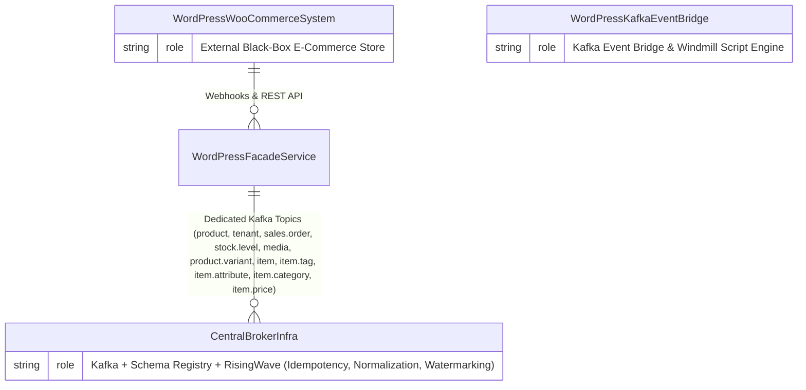

# 3. Context and Scope

## 3.1 Business Context
The **WordPress Kafka Event Bridge** connects internal core application microservices with external WordPress/WooCommerce instances over Apache Kafka. It isolates external schema changes, translates payloads to canonical forms, and manages rate limiting and retries.

Refer to the C4 System Model in [`c4/01-system-context.md`](../c4/01-system-context.md) for full ERD definitions and relationship structures.

## 3.2 Technical Scope & Interfaces
- **Inbound Webhook Interface**: Receives raw JSON HTTP POSTs from WooCommerce webhooks at `/f/wordpress-kafka/{entity}`.
- **Outbound HTTP Push Interface**: Receives normalized and deduplicated events from RisingWave HTTP Push Sinks at `/f/wordpress-kafka/{entity}` and executes synchronous REST requests against WooCommerce (`/wp-json/wc/v3/...`).
- **Kafka Messaging Interface**: Communicates over dedicated Kafka topics: `product`, `tenant`, `sales.order`, `stock.level`, `media`, `product.variant`, `item`, `item.tag`, `item.attribute`, `item.category`, and `item.price`.
