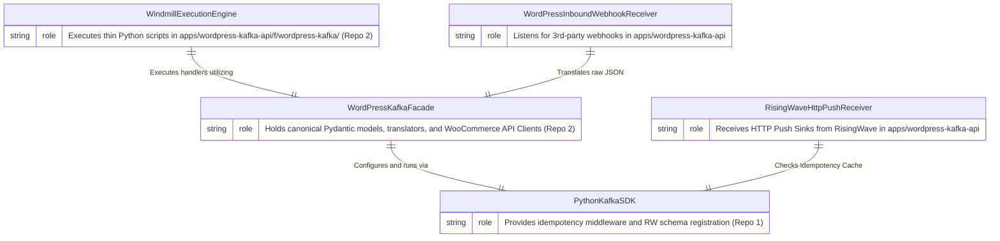

# 5. Building Block View

## 5.1 Level 1: System Building Blocks
The system operates within a 3-Layer, 2-Repository architecture:
1. **Infrastructure SDK (`python-kafka` Repo 1)**: Abstract SDK responsible for Schema Registry sync, RisingWave SQL generator, and Idempotency Middleware.
2. **Domain Facade & Anti-Corruption Layer (`wordpress-kafka` Repo 2, Layer 2)**: Core business logic, Pydantic canonical models, webhook parsing, and CloudEvents mapping.
3. **Execution Engine (`wordpress-kafka` Repo 2, Layer 3)**: Windmill scripts under `apps/wordpress-kafka-api/f/wordpress-kafka/` representing inbound/outbound execution endpoints.

Refer to [`c4/02-container.md`](../c4/02-container.md) and [`c4/03-component.md`](../c4/03-component.md) for complete entity definitions and C2/C3 container breakdowns.



## 5.2 Level 2: Subsystem Component Breakdown
- **`WindmillInboundWebhookScript`**: Receives incoming WooCommerce webhooks, validates payloads with canonical models, uses the ACL for translation, and publishes directly to Kafka topics.
- **`WindmillOutboundSyncScript`**: Consumes RisingWave HTTP Push Sinks. Uses `PythonKafkaSDK` to run idempotency checks, then validates/formats payloads using `WordPressKafkaFacade` and executes non-blocking WooCommerce REST calls via `httpx.AsyncClient`.

## 5.3 Level 3: Repository Decomposition
The execution environment (`wordpress-kafka`) is structured to separate execution runtime scripts from shared application logic:

```text
wordpress-kafka/
├── apps/
│   └── wordpress-kafka-api/             # Windmill Execution App (Layer 3)
│       ├── wmill.yaml
│       └── f/
│           └── wordpress-kafka/         # Windmill scripts
│               ├── products.py          
│               ├── orders.py            
│               └── sites.py             
└── src/
    └── wordpress_kafka/                 # Core Domain Package (Layer 2)
        ├── config/              
        ├── core/                
        ├── utils/               
        └── modules/             
            ├── products/        # Product schemas, service, client
            ├── orders/          # Order schemas, service, client
            ├── categories/      # Category schemas, service, client
            ├── tags/            # Tag schemas, service, client
            ├── attributes/      # Attribute schemas, service, client
            ├── media/           # Media schemas, service, client
            └── sites/           # Site provisioning & OAuth credentials
