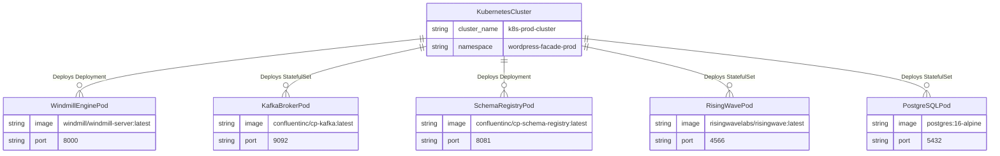

# 7. Deployment View

## 7.1 Infrastructure & Topology Map

## 7.2 Port and Protocol Allocation
| Node / Service | Internal Port | External Port | Protocol | Purpose |
| :--- | :--- | :--- | :--- | :--- |
| `wordpress-facade` | 8000 | 443 (Ingress) | HTTP/REST | Inbound Webhooks & RW Push Receiver |
| `kafka-broker` | 9092 | 9092 | TCP/Kafka | Message Streaming Transport |
| `schema-registry` | 8081 | 8081 | HTTP/REST | Avro Schema Registration |
| `risingwave` | 4566 | 4566 | PostgreSQL Wire | SQL Query & Stream Topology Management |
| `postgres` | 5432 | 5432 | PostgreSQL Wire | Facade Outbox & Idempotency Storage |
