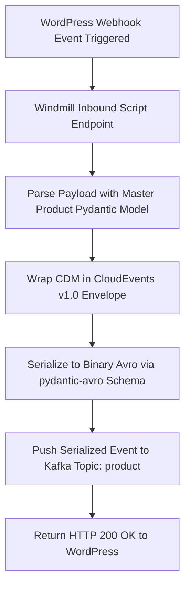

# BPMN Workflow: WordPress Inbound Webhook Processing

This workflow models the inbound event ingestion when WordPress/WooCommerce triggers a webhook notification to the Windmill script endpoint, which validates, transforms, and publishes the event to Apache Kafka topic `product`.

