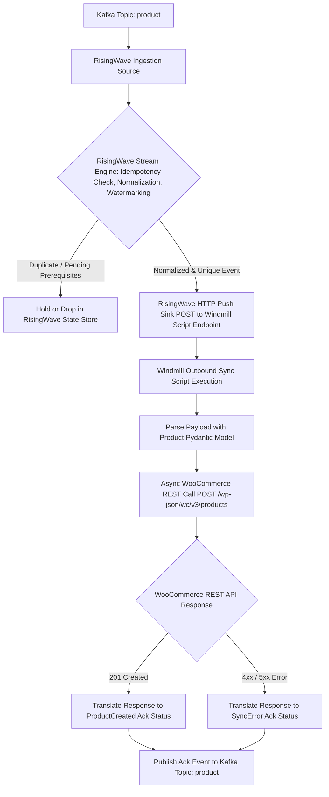

# BPMN Workflow: Outbound Product Creation Workflow

This workflow models the outbound execution path when a product creation event is consumed from Kafka topic `product` by RisingWave. RisingWave executes idempotency check, normalization, and watermarking before pushing the event to the Windmill script to create the product in WooCommerce via REST API.

