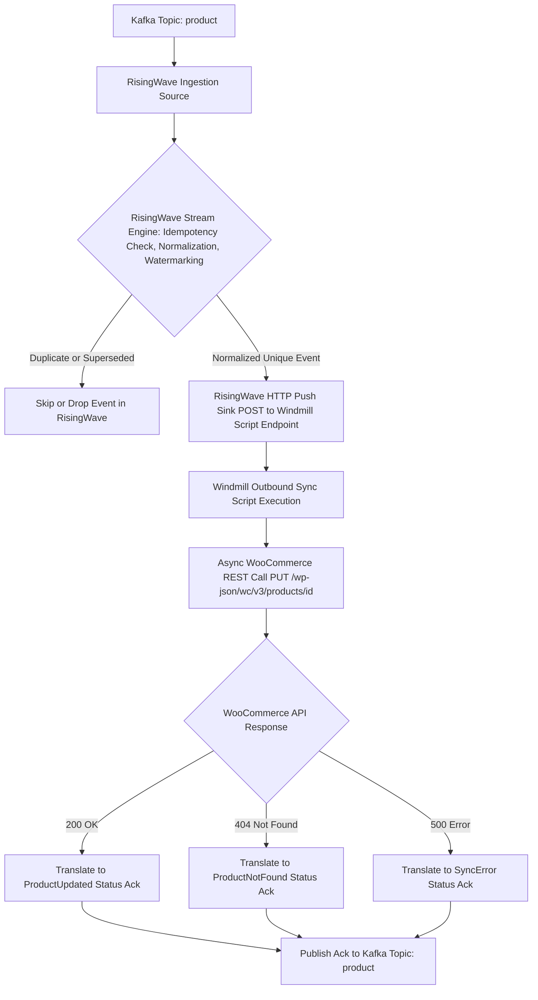

# BPMN Workflow: Outbound Product Update Workflow

This workflow models the modification of existing WooCommerce product entities via `PUT /wp-json/wc/v3/products/{id}`. RisingWave performs idempotency check, normalization, and watermarking on Kafka topic `product` before triggering the Windmill script.

