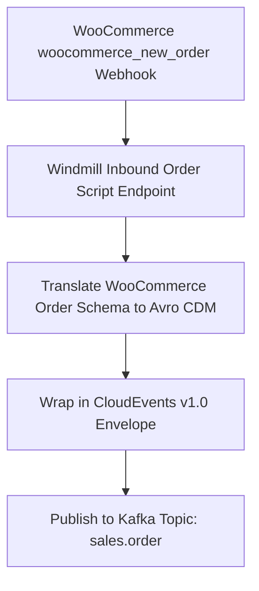

# BPMN Workflow: Inbound Order Created Workflow

This workflow models inbound order notifications initiated by WooCommerce webhooks when a customer places an order, publishing the canonical event directly to Apache Kafka topic `sales.order`.

