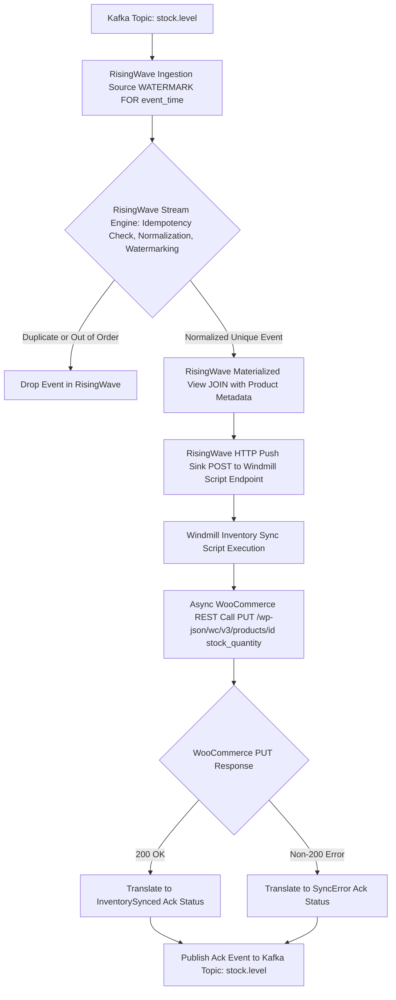

# BPMN Workflow: Outbound Inventory Synchronization Workflow

This workflow models the real-time synchronization of stock levels and inventory quantities from Kafka topic `stock.level` to WooCommerce products. RisingWave performs idempotency check, normalization, and watermarking before triggering the Windmill script.

