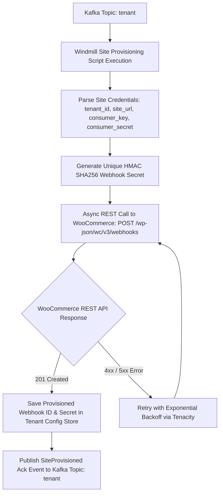

# BPMN Workflow: Site Webhook Self-Provisioning Workflow

This workflow models the dynamic self-provisioning execution path when a site provisioning event is published to Kafka topic `tenant`. The **WordPress Kafka Event Bridge** consumes the event from Kafka and automatically provisions inbound webhooks on the tenant's remote WordPress site via the WooCommerce REST API (`POST /wp-json/wc/v3/webhooks`).

