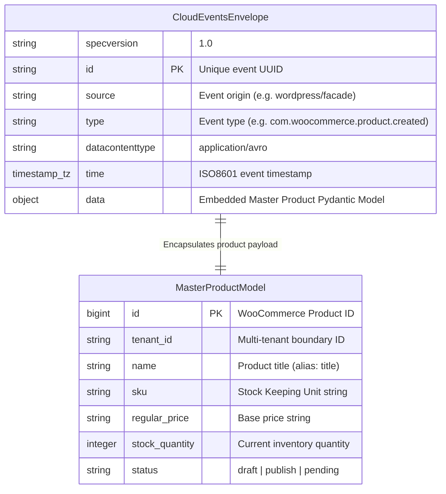

# C3 Component Breakdown: WordPress Kafka Event Bridge Data Models

### A. CloudEvents v1.0 Envelope & Product Model Structure



### B. WooCommerce Product Canonical Schema (`wc/v3/products`)

```mermaid
erDiagram
    CanonicalProduct {
        bigint id PK "WooCommerce Product ID"
        string tenant_id "Multi-tenant boundary ID"
        string name "Product title"
        string slug "Product URL slug"
        string permalink "Product direct URL"
        timestamp_tz date_created "Creation timestamp"
        timestamp_tz date_modified "Modification timestamp"
        string type "simple | grouped | external | variable"
        string status "draft | pending | private | publish | future | trash"
        boolean featured "Featured product flag"
        string catalog_visibility "visible | catalog | search | hidden"
        string description "Full HTML/Text product description"
        string short_description "Short HTML/Text excerpt"
        string sku "Stock Keeping Unit string"
        string global_unique_id "GTIN / UPC / EAN / ISBN"
        string regular_price "Base price string"
        string sale_price "Discounted sale price string"
        timestamp_tz date_on_sale_from "Sale start date"
        timestamp_tz date_on_sale_to "Sale end date"
        boolean virtual "Virtual item flag"
        boolean downloadable "Downloadable item flag"
        boolean manage_stock "Stock management toggle"
        integer stock_quantity "Current inventory quantity"
        string stock_status "instock | outofstock | onbackorder"
        string backorders "no | notify | yes"
        string weight "Weight measurement in kg"
        string shipping_class "Shipping class slug"
    }

    Site {
        string tenant_id PK "Multi-tenant tenant identifier"
        string site_url "Target WooCommerce Base REST URL"
        string consumer_key "OAuth1.0a Consumer Key"
        string consumer_secret "OAuth1.0a Consumer Secret"
        string webhook_secret "HMAC SHA256 Webhook Verification Secret"
        string status "ACTIVE | PROVISIONING | DISABLED"
    }

    Order {
        bigint order_id PK "WooCommerce Order ID"
        string tenant_id "Tenant boundary ID"
        string status "pending | processing | completed | cancelled"
        string total "Order total monetary string"
        array_object line_items "Purchased items list"
    }

    Category {
        integer category_id PK "WooCommerce Category ID"
        string name "Category display name"
        string slug "Category slug"
    }

    Tag {
        integer tag_id PK "WooCommerce Tag ID"
        string name "Tag display name"
        string slug "Tag slug"
    }

    Media {
        integer media_id PK "Media / Image attachment ID"
        string src "Image source URL"
        string name "Image title"
        string alt "Image ALT text"
    }

    Attribute {
        integer attribute_id PK "Attribute ID"
        string name "Attribute display name"
        integer position "Sorting position index"
        boolean visible "Visible on frontend flag"
        boolean variation "Used for variations flag"
        array_string options "List of attribute terms"
    }

    Site ||--o{ CanonicalProduct : "hosts products"
    Site ||--o{ Order : "receives orders"
    CanonicalProduct ||--o{ Category : "belongs to categories"
    CanonicalProduct ||--o{ Tag : "tagged with"
    CanonicalProduct ||--o{ Media : "contains media assets"
    CanonicalProduct ||--o{ Attribute : "defines product attributes"